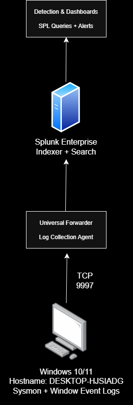

# Home SOC Lab

This repository documents my home SOC lab, built to better understand how endpoint telemetry is collected, forwarded, and analyzed in a SIEM, while building practical detection engineering skills.

The lab currently consists of a Windows 11 endpoint forwarding Windows Event Logs and Sysmon telemetry through a Splunk Universal Forwarder into a local Splunk Enterprise instance. As the project grows, I plan to add custom detections, dashboards, attack simulations, and Active Directory.

## Current Lab

- Windows 11
- Splunk Enterprise (local instance)
- Splunk Universal Forwarder
- Windows Event Logs
  - Security
  - System
  - Application
- Sysmon

## Architecture



## Documentation

- [Setup Guide](docs/setup.md) — Sysmon, Universal Forwarder, and TA configuration
- [Troubleshooting: Sourcetype Conflict](docs/troubleshooting.md) — diagnosing a real config conflict between two overlapping Sysmon add-ons
- [Investigation: 4625 Baseline vs Anomaly](docs/analysis-4625-baseline-vs-anomaly.md) — reading failed logon events carefully instead of taking them at face value

## Current Progress

- [x] Install and configure Splunk Enterprise
- [x] Install Splunk Universal Forwarder
- [x] Forward Windows Event Logs
- [x] Install and configure Sysmon
- [x] Verify telemetry ingestion
- [x] Diagnose and fix a sourcetype parsing conflict
- [ ] Build dashboards
- [ ] Simulate attacks
- [ ] Map detections to MITRE ATT&CK

## Repository Structure
````
architecture/     diagram source and exported image
docs/             setup guide, troubleshooting, and investigation writeups
screenshots/      raw evidence referenced from docs
detections/       SPL queries once built
````
## Roadmap

### Phase 1
- Windows Event Log collection
- Sysmon deployment
- Splunk Enterprise integration

### Phase 2
- Failed logon detection
- PowerShell detection
- Registry monitoring

### Phase 3
- Atomic Red Team
- Dashboards
- MITRE ATT&CK mapping

### Phase 4
- Active Directory
- Multi endpoint monitoring
- Threat hunting scenarios
