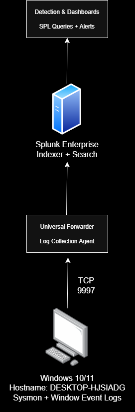

# Home SOC Lab
 
This repository documents my home SOC lab, built to better understand how endpoint telemetry is collected, forwarded, and analyzed in a SIEM, while building practical detection engineering skills.
 
The lab currently consists of a Windows 11 endpoint forwarding Windows Event Logs and Sysmon telemetry through a Splunk Universal Forwarder into a local Splunk Enterprise instance. As the project grows, I plan to add custom detections, dashboards, attack simulations, and Active Directory.
 
## Current Lab
 
- Windows 11
- Splunk Enterprise (local instance)
- Splunk Universal Forwarder
- Windows Event Logs
  - Security
  - System
  - Application
- Sysmon
## Architecture
 

 
## Documentation
 
- [Setup Guide](docs/setup.md) — Sysmon, Universal Forwarder, and TA configuration
- [Troubleshooting: Sourcetype Conflict](docs/troubleshooting.md) — diagnosing a real config conflict between two overlapping Sysmon add-ons
- [Investigation: 4625 Baseline vs Anomaly](docs/analysis-4625-baseline-vs-anomaly.md) — reading failed logon events carefully instead of taking them at face value
## Detections
 
- [Encoded PowerShell Execution](detections/encoded-powershell-execution/encoded-powershell-execution.md) — T1059.001 / T1027
- [Repeated Local Logon Failures](detections/repeated-local-logon-failures/repeated-local-logon-failures.md) — T1110, built directly from the 4625 investigation above
- [Registry Run Key Persistence](detections/registry-monitoring/registry-monitoring.md) — T1547.001
## Current Progress
 
- [x] Install and configure Splunk Enterprise
- [x] Install Splunk Universal Forwarder
- [x] Forward Windows Event Logs
- [x] Install and configure Sysmon
- [x] Verify telemetry ingestion
- [x] Diagnose and fix a sourcetype parsing conflict
- [x] Create detection rules
- [x] Map detections to MITRE ATT&CK
- [ ] Build dashboards
- [ ] Simulate attacks
## Repository Structure
 
```
architecture/     diagram source and exported image
docs/             setup guide, troubleshooting, and investigation writeups
screenshots/      raw evidence referenced from docs, organized by topic
  setup/
  troubleshooting/
  analysis/
detections/       one subfolder per detection, each with its query, writeup, and screenshots
  encoded-powershell-execution/
  repeated-local-logon-failures/
  registry-monitoring/
```
 
## Roadmap
 
### Phase 1
- [x] Windows Event Log collection
- [x] Sysmon deployment
- [x] Splunk Enterprise integration
### Phase 2
- [x] Failed logon detection
- [x] PowerShell detection
- [x] Registry monitoring
### Phase 3
- [ ] Dashboards
- [ ] Additional manually simulated detections
### Phase 4
- [ ] Active Directory
- [ ] Microsoft Defender for Endpoint
- [ ] Multi endpoint monitoring
- [ ] Threat hunting scenarios
