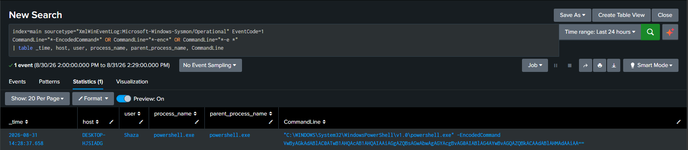

# Detection: Encoded PowerShell Execution

## Why I built this one

This was actually the first real detection I tried to write for the lab, mostly because it felt like a good starting point. Encoded PowerShell shows up in basically every SOC training material I have gone through, and I wanted to see if I could actually catch it myself instead of just reading about it.

The idea behind it is simple. Attackers use the `-EncodedCommand` flag (or the shorthand `-enc`) to pass a Base64 encoded string to PowerShell instead of a plain text command. It runs exactly the same either way, but the encoding makes it harder to read at a glance, both for a defender scanning logs and for anything doing simple keyword matching. It is also just a normal thing PowerShell supports, so plenty of legitimate scripts use it too, which is part of why this is a decent detection to think through instead of a trivial one.

## Simulating it

I did not want to run anything actually malicious, so I encoded a completely harmless command:

```powershell
$command = 'Write-Output "hello from encoded test"'
$bytes = [System.Text.Encoding]::Unicode.GetBytes($command)
$encoded = [Convert]::ToBase64String($bytes)
powershell.exe -EncodedCommand $encoded
```

That produced a normal PowerShell process launch with the encoded string sitting right in the command line, which is exactly what I wanted Sysmon to pick up.

## Confirming Sysmon actually caught it

```powershell
Get-WinEvent -LogName "Microsoft-Windows-Sysmon/Operational" -MaxEvents 500 | Where-Object { $_.Id -eq 1 -and $_.Message -like "*powershell*" -and $_.Message -like "*EncodedCommand*" }
```

It did. The full event showed the real command line with the flag and the Base64 payload, my actual user account, and the parent process. One thing I noticed that I did not expect going in, the parent process was also powershell.exe, not something like cmd.exe or explorer.exe. I had pictured this more as an Office document or a script kicking off PowerShell, so seeing PowerShell spawn PowerShell was a small reminder that my test does not perfectly mirror a real phishing style chain, it is just proving the detection catches the flag itself.

## The detection

```spl
index=main sourcetype="XmlWinEventLog:Microsoft-Windows-Sysmon/Operational" EventCode=1
CommandLine="*-EncodedCommand*" OR CommandLine="*-enc*" OR CommandLine="*-e *"
| table _time, host, user, process_name, parent_process_name, CommandLine
```

Ran it, and it surfaced exactly the one event I had just generated, nothing else.



## Why it usually shows nothing

Running this search on a normal day, with nothing simulated, returns zero results. That is expected and not a sign anything is broken. This is a low frequency detection by design, it should stay quiet unless someone actually runs an encoded command, so an empty result most of the time is exactly what a working detection like this should look like.

## ATT&CK mapping

T1059.001, Command and Scripting Interpreter, PowerShell.

T1027, Obfuscated Files or Information, for the Base64 encoding itself.

## What I would do differently next time

If I revisit this, I want to simulate a more realistic parent process chain, something like a macro enabled document spawning PowerShell, instead of just running the encoded command directly from an existing PowerShell session. That would make the parent_process_name field actually mean something in this specific detection, rather than just being along for the ride.
