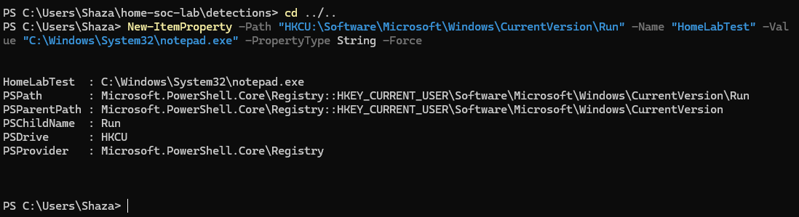
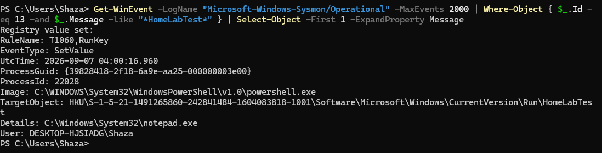
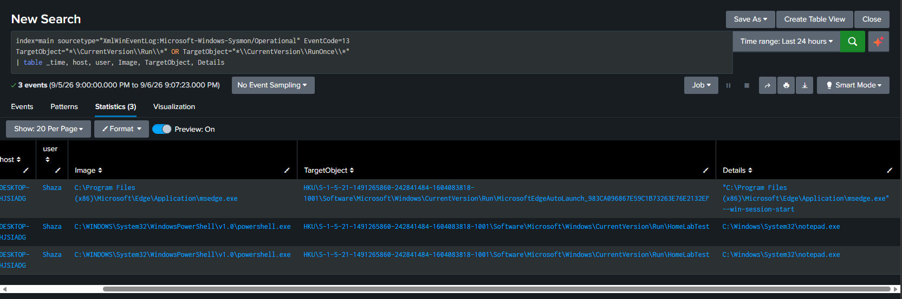

# Detection: Registry Run Key Persistence
 
## Why this one
 
Persistence is one of those categories that comes up constantly in SOC training material, and Run keys are usually the first example anyone gives. The idea is simple enough, an attacker adds an entry to a spot in the registry that Windows checks on every login, and whatever program that entry points to just runs automatically from then on. I wanted to actually see that happen in my own logs instead of just reading about it again.
 
## Simulating it
 
I did not want to touch anything that could actually persist on my machine in a way I would forget to clean up, so I picked a completely obvious name and a harmless target.
 
```powershell
New-ItemProperty -Path "HKCU:\Software\Microsoft\Windows\CurrentVersion\Run" -Name "HomeLabTest" -Value "C:\Windows\System32\notepad.exe" -PropertyType String -Force
```
 

 
Worth saying plainly, a real attacker is not going to name their entry HomeLabTest. They are going to pick something that looks like it belongs, some plausible sounding update helper or driver service. My detection needs to work off the pattern of a new entry appearing in this location, not off the specific name I happened to use for testing.
 
## Confirming Sysmon caught it
 
```powershell
Get-WinEvent -LogName "Microsoft-Windows-Sysmon/Operational" -MaxEvents 2000 | Where-Object { $_.Id -eq 13 -and $_.Message -like "*HomeLabTest*" } | Select-Object -First 1 -ExpandProperty Message
```
 

 
It did, and there was a detail in here I did not expect. The RuleName field on the event already says T1060,RunKey. The SwiftOnSecurity config I have been using since the very start of this lab is not just filtering noise, it is tagging certain events with ATT&CK technique IDs on its own. I did not build that part, but it was genuinely useful to notice it was already there. Small note for accuracy, T1060 is the older ATT&CK ID for this technique, current ATT&CK calls it T1547.001, so the config itself is running a slightly outdated label even though the detection logic is still correct.
 
Also worth mentioning, this event actually attributed cleanly to my real account, Shaza, unlike basically everything in my earlier 4625 investigation. Registry auditing apparently does not have the same attribution problem local logon auditing did on this machine.
 
## The detection
 
```spl
index=main sourcetype="XmlWinEventLog:Microsoft-Windows-Sysmon/Operational" EventCode=13
TargetObject="*\\CurrentVersion\\Run\\*" OR TargetObject="*\\CurrentVersion\\RunOnce\\*"
| table _time, host, user, Image, TargetObject, Details
```
 
My first version of this query also matched a completely unrelated key called RunNotification, which is not a real persistence location, so I tightened the path matching to just Run and RunOnce specifically.
 

 
## What this told me that I was not expecting
 
Running the tightened query still returned three results, not one. Two of them were my own test, since I had run the same command twice while checking my work. The third was Microsoft Edge, registering its own auto launch entry under the exact same Run key.
 
That is not a bug in the query. That is just what this key actually looks like in practice. Legitimate software registers startup entries here constantly, browsers especially. A detection built purely on watching this key fire an alert every time it is touched is going to be noisy in any real environment, not because the query is wrong, but because the behavior itself is genuinely common and mostly benign.
 
## Being honest about the limitation
 
This detection tells you a new Run key entry was created, who created it, and what it points to. It does not tell you whether that entry is malicious on its own. In a real environment this would need either a baseline of known, expected entries to exclude, something like known browser and update helper names, or it needs to be handed to an analyst to triage rather than auto alerting on every hit. I am not pretending this is a finished, production ready detection. It is a working starting point that surfaces the right events, and the actual judgment call still belongs to a person.
 
## ATT&CK mapping
 
T1547.001, Boot or Logon Autostart Execution, Registry Run Keys and Startup Folder. Noting again that Sysmon's own rule tags this with the older T1060 identifier, which is worth knowing if I ever need to cross reference this against current ATT&CK documentation.
 
## What I would do differently next time
 
I would want to build a small allowlist of common legitimate Run key entries, browsers, cloud sync clients, that kind of thing, and exclude those from the alert while still logging them, so the detection only surfaces genuinely unexpected entries instead of every single one. That feels like the realistic next step rather than something I need to solve right now.
