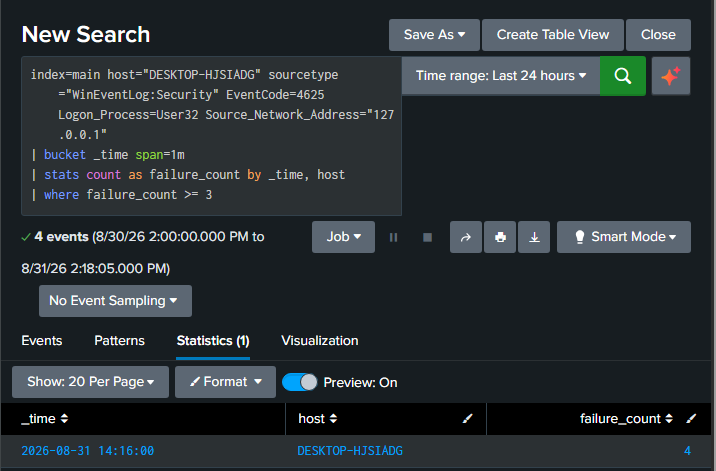
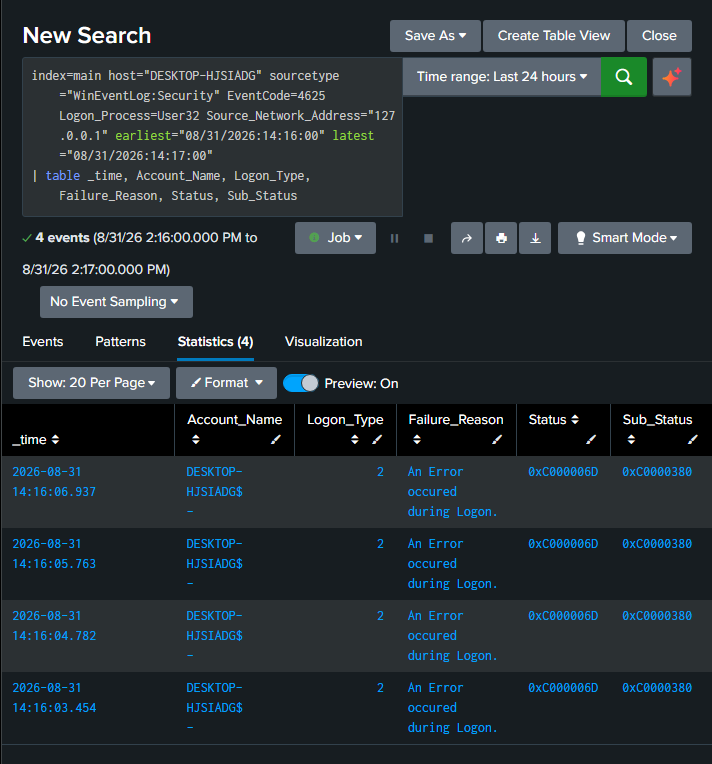

# Detection: Repeated Local Logon Failures

## Where this one actually came from

This detection did not start as a detection. It started as an investigation that went sideways.

I originally set out to grab a clean brute force example for this lab, locked my machine, typed the wrong password a few times, and expected a simple failed logon followed by a success under my own account. Instead I ended up spending a long time figuring out that the account field on these events was not attributing to me at all, on two separate tests, PIN and password both. The full writeup for that is in `docs/analysis-4625-baseline-vs-anomaly.md`, and it is honestly a more interesting document than this one, since it is the reason this detection is built the way it is.

Once I accepted that account based filtering was not going to work reliably on this host, I had a choice. I could drop the idea entirely, or I could build something around what I actually knew was reliable, which was the pattern itself, not the identity behind it.

## The fingerprint

Every failed logon I generated, regardless of PIN or password, showed the same signature. Subject account of DESKTOP-HJSIADG$, Logon_Process of User32, source address of 127.0.0.1, blank target account. That consistency is what makes this detection possible even without a real username to key off of.

## The detection

```spl
index=main host="DESKTOP-HJSIADG" sourcetype="WinEventLog:Security" EventCode=4625 Logon_Process=User32 Source_Network_Address="127.0.0.1"
| bucket _time span=1m
| stats count as failure_count by _time, host
| where failure_count >= 3
```

This groups matching failures into one minute buckets and only surfaces a bucket if three or more failures happened inside it. It is intentionally not filtering by account, since I already proved that field is not something I can rely on here.

## Verifying it fires

I locked my machine and failed the logon a few times on purpose, then ran the query.



One row came back, today's date, four failures in a single minute. Then I pulled the raw events behind that number just to make sure the aggregation was actually counting what I thought it was counting, and not some artifact of the bucket logic.



Four raw events, same minute, same fingerprint across all of them. The math checked out.

## Being honest about the limitation

This is not a textbook brute force detection, and I do not want to present it like one. A real SOC detection for this technique would ideally tell you who the failing account is, so you know whether it is one user getting locked out or someone actually hammering credentials from outside. This one cannot do that on this host, at least not reliably, and I have not fully solved why.

What it can do is tell you that repeated local authentication failures happened, in a tight window, on this specific machine. That is still a real signal, it is just a narrower one than I originally wanted to build.

## ATT&CK mapping

T1110, Brute Force. The technique still applies at the pattern level even without clean account attribution, since the detection is built around repeated failed authentication attempts, which is the core behavior T1110 detections are meant to catch.

## What I would do differently next time

I would want to test this same setup against a domain joined machine instead of a standalone local host, since I suspect a lot of the account attribution weirdness here is specific to local Windows Hello and Credential Manager behavior rather than something universal. That is part of why Active Directory is next on my list for this lab.
