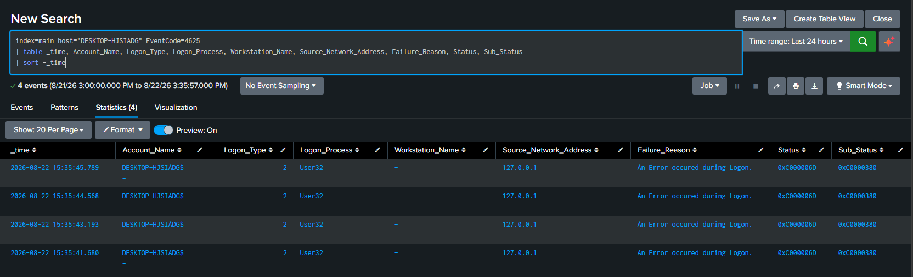
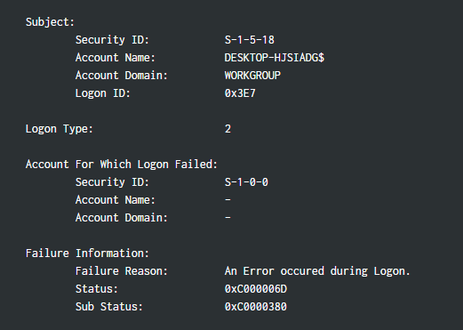
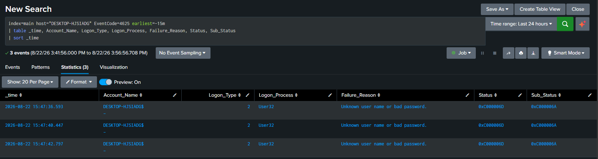

# Investigation: What a Failed Logon Actually Told Me

## The moment

I wanted a clean example of a brute force pattern for this lab, so I locked my machine and typed the wrong password four times in a row before logging in correctly. A few minutes later I pulled the logs expecting an easy win: four 4625 failed logon events, back to back, seconds apart. On the surface that is exactly what a brute force attempt looks like.

I almost took it at face value. Then I actually read the fields.

## What the search showed

```spl
index=main host="DESKTOP-HJSIADG" EventCode=4625
| table _time, Account_Name, Logon_Type, Logon_Process, Workstation_Name, Source_Network_Address, Failure_Reason, Status, Sub_Status
| sort -_time
```



Four events, seconds apart, same host. It matched the story I already had in my head, so it would have been easy to just screenshot this and call it a brute force detection.

## Where it fell apart

A 4625 event actually carries two separate identity fields, and it is easy to confuse them.

Subject is the account reporting the failure. This is often just a local system process checking something in the background, not the person sitting at the keyboard.

Account For Which Logon Failed is the actual username that was typed and rejected. This is the field that should show me.

The table above only surfaces the Subject, which is why every row shows a machine account instead of my name. So I pulled the raw event to see the rest of it.



The target account field was blank, with a Null SID. That stopped me. Even a wrong password still requires Windows to know which username was being attempted. A blank field with a Null SID means the system never got that far. Whatever this was, it was not someone typing my password incorrectly at the lock screen.

## Ruling myself out

I sign in with a PIN through Windows Hello, not a typed password, and that distinction turned out to matter a lot. PIN validation happens locally against the device's TPM and does not travel through the same Negotiate and NTLM pipeline that a password based logon uses, which happens to be the exact pipeline responsible for populating that target account field in a standard 4625 event. So my real failed PIN attempts were never going to show up the way I expected them to.

I also found other people online reporting this identical fingerprint, the same Subject account, the same svchost.exe and User32 combination, the same Status and Sub Status codes, with no real explanation from Microsoft either. It looks like a routine background authentication check, not an actual credential failure.

So the four events I was ready to screenshot as my brute force example were not my attempts. They were something else entirely that just happened to land in the same window.

## Trying again, and getting a real answer

I went back and repeated the test using an actual typed password instead of a PIN, expecting this to finally give me a clean, attributable failure. It did not, and that turned out to be the more interesting result.

```spl
index=main host="DESKTOP-HJSIADG" EventCode=4625 earliest=-15m
| table _time, Account_Name, Logon_Type, Logon_Process, Failure_Reason, Status, Sub_Status
| sort _time
```

Every single password attempt produced the exact same fingerprint as the PIN attempts before it, same Subject account, same blank target, same svchost.exe and User32 combination. The only thing that changed was the Sub Status, which shifted from the earlier unresolved 0xC0000380 to 0xC000006A, the code that specifically means wrong password. That was a real signal that something different was happening this time, I just was not seeing it in the field I expected.

So I widened the search to look at everything happening around that exact timestamp, not just 4625 events.

```spl
index=main host="DESKTOP-HJSIADG" sourcetype="WinEventLog:Security" earliest="08/22/2026:15:47:30" latest="08/22/2026:15:48:00"
| table _time, EventCode, Account_Name, Logon_Type, Failure_Reason
| sort _time
```



Right before the 4625 failure landed, there was a burst of EventCode 5379 events, Credential Manager credential reads, tagged to my actual account, Shaza, milliseconds earlier. That is the closest thing to my real account showing up anywhere in this whole sequence. My best read is that typing the password triggers a check against cached credentials first, and when that comes back negative the actual logon failure still gets attributed to the machine account rather than to me. I want to be honest that I do not have solid documentation confirming that is exactly what is happening internally, it is my interpretation of the timing, not a confirmed mechanism.

What I can say for certain is the observed result: two separate tests, PIN and password, both produced a 4625 failure that never resolved to my real username. That is a stronger and more complete finding than the PIN test alone gave me.

## What this actually taught me

An event code alone does not tell you what happened. I looked at this same 4625 code across two separate tests, PIN and password, and it told a different part of the story each time.

The Subject field and the target account field are answering two different questions, and I definitely used to just conflate them without realizing it. Get that wrong and you either miss something real or chase something that was never there in the first place.

A blank target account with a Null SID is its own thing, not just a normal wrong password. I hadn't thought about that distinction before this.

And the authentication method piece is the one I keep coming back to, especially now that it held up on a second test. If an environment leans on PIN, biometric sign in, or even just a Credential Manager check ahead of the real logon attempt, there is a real gap in 4625 based brute force detection that I would not have known to look for otherwise.

## Where I left it

I went in expecting to walk away with a clean before and after pair for a brute force detection. Instead I walked away with something I think is more useful: a confirmed, twice tested finding that this specific setup does not produce an attributable 4625 event no matter how the failed logon happens. That is not the detection I set out to build, but it is a real and honest result, and it tells me exactly what any detection I build on top of this data actually needs to account for.
