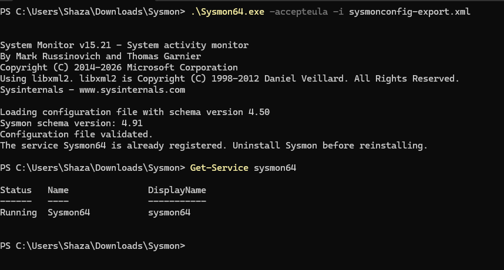
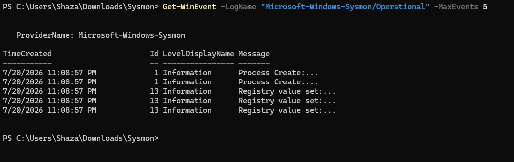
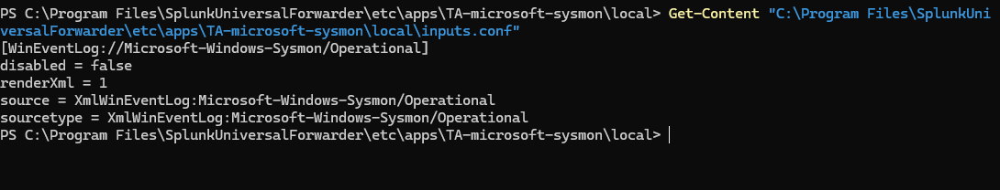

# Setup Walkthrough

This document covers how the lab was built: Sysmon installation, Universal Forwarder configuration, and getting Sysmon events properly parsed into Splunk's CIM (Common Information Model).

## Prerequisites

This document assumes Splunk Enterprise and the Splunk Universal Forwarder are already installed on the host, using the standard installers from [Splunk's download page](https://www.splunk.com/en_us/download.html). Installation itself is a straightforward guided setup and is not covered here. What follows picks up from that baseline: getting Sysmon installed and its telemetry properly parsed into Splunk.

## Environment

- Host: Windows machine (`DESKTOP-HJSIADG`)
- Splunk Enterprise: installed locally, acting as indexer and search head
- Splunk Universal Forwarder: installed on the same host, collecting and forwarding logs
- Index: `main`

## 1. Install Sysmon

I downloaded the Sysmon installer directly from [Microsoft's Sysinternals page](https://learn.microsoft.com/en-us/sysinternals/downloads/sysmon), then extracted it into a working folder.


I also grabbed the [SwiftOnSecurity Sysmon config](https://github.com/SwiftOnSecurity/sysmon-config), the industry standard starting configuration for balanced signal to noise logging, rather than running Sysmon with its bare defaults.

Installed it with:

```powershell
.\Sysmon64.exe -accepteula -i sysmonconfig-export.xml
```

Verified the service was actually running, rather than just assuming the install succeeded:

```powershell
Get-Service sysmon64
```



Then confirmed real events were being generated:

```powershell
Get-WinEvent -LogName "Microsoft-Windows-Sysmon/Operational" -MaxEvents 5
```



Seeing actual process creation events come back here was the first real confirmation that Sysmon was working end to end, not just installed and sitting idle.

## 2. Configure the Universal Forwarder to collect Sysmon logs

Sysmon logging locally is only half the pipeline. The Universal Forwarder needed to actually pick up that log channel and send it to Splunk.

I installed the **TA-microsoft-sysmon** add-on, which handles both the input configuration and sourcetype tagging on the forwarder side, into:

```
C:\Program Files\SplunkUniversalForwarder\etc\apps\
```

By default, this add-on ships with the Sysmon input disabled. Rather than editing the file under `default\` directly, which gets overwritten on upgrades, I created a proper `local` override instead:

```
C:\Program Files\SplunkUniversalForwarder\etc\apps\TA-microsoft-sysmon\local\inputs.conf
```

```ini
[WinEventLog://Microsoft-Windows-Sysmon/Operational]
disabled = false
renderXml = 1
source = XmlWinEventLog:Microsoft-Windows-Sysmon/Operational
sourcetype = XmlWinEventLog:Microsoft-Windows-Sysmon/Operational
```



Then restarted the forwarder service to apply the change:

```powershell
Restart-Service SplunkForwarder
```

## 3. Verify data is landing in Splunk

```spl
index=main host="DESKTOP-HJSIADG" sourcetype="XmlWinEventLog:Microsoft-Windows-Sysmon/Operational"
| table _time, process_name, parent_process_name, dest, user, CommandLine
```


At this stage, `process_name` and `parent_process_name` showed real values, things like `cmd.exe` and `splunkd.exe`, confirming Sysmon events were being correctly parsed into CIM compliant fields rather than just landing as raw XML in Splunk.

## 4. Confirming configuration with `btool`

Splunk's `btool` turned out to be essential for confirming exactly which config file is actually winning for a given stanza, across all the layered `default` and `local` configs, rather than just assuming the configuration I wrote was the one being applied.

```powershell
& "C:\Program Files\SplunkUniversalForwarder\bin\splunk.exe" btool inputs list "WinEventLog://Microsoft-Windows-Sysmon/Operational" --debug
```


This shows every file contributing settings to that input, in priority order. That turned out to matter a lot later, since it is the exact tool that helped me catch a real config conflict further down the line. See [troubleshooting.md](troubleshooting.md) for that story.

## Result

A working pipeline: Sysmon, Windows Event Log, Universal Forwarder, Splunk indexer, and CIM mapped searchable fields (`process_name`, `parent_process_name`, `dest`, `user`, `CommandLine`, and others), ready for detection engineering.
