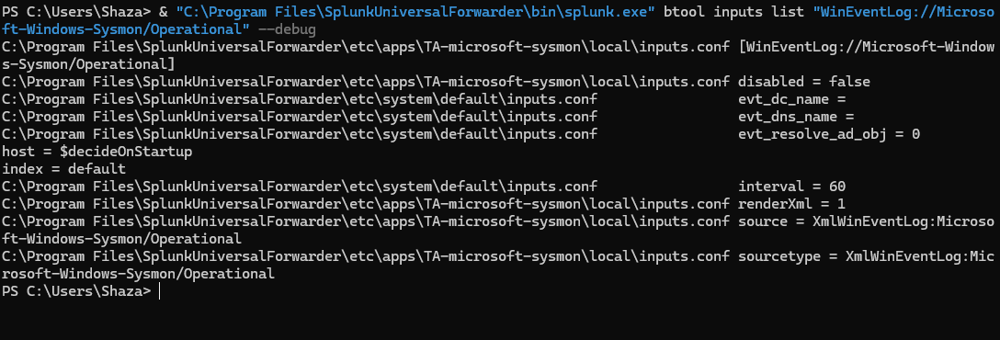
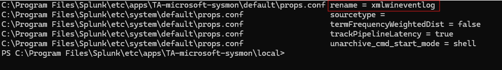
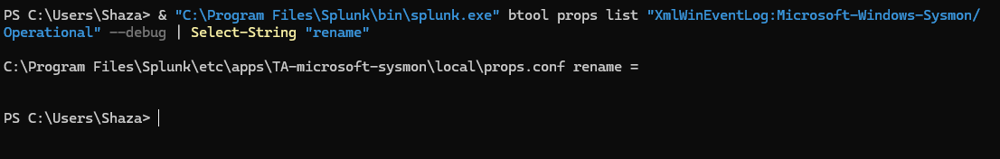
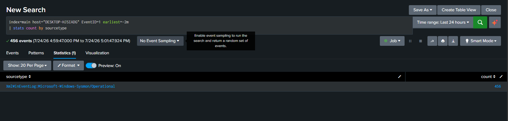

# Troubleshooting: The Case of the Sourcetype That Would Not Stick

## The problem

After getting Sysmon installed and the TA on my Universal Forwarder configured with an explicit sourcetype override, I expected events to land in Splunk tagged as XmlWinEventLog:Microsoft Windows Sysmon/Operational. Instead, every single event kept showing up as the generic xmlwineventlog sourcetype, no matter what I changed.

I checked the forwarder config with btool and it confirmed my sourcetype setting was correct and active.

```powershell
& "C:\Program Files\SplunkUniversalForwarder\bin\splunk.exe" btool inputs list "WinEventLog://Microsoft Windows Sysmon/Operational" --debug
```



The output showed my sourcetype line sitting there, clearly winning. So the forwarder was doing exactly what I told it to do. Which meant the problem had to be happening somewhere after the forwarder, not because of it.

## Finding the actual cause

Since I also run a local Splunk Enterprise instance on the same machine, I checked the props configuration on the indexer side using the same tool.

```powershell
& "C:\Program Files\Splunk\bin\splunk.exe" btool props list "XmlWinEventLog:Microsoft Windows Sysmon/Operational" --debug
```

And there it was:

```
C:\Program Files\Splunk\etc\apps\Splunk_TA_microsoft_sysmon\default\props.conf   rename = xmlwineventlog
```



A completely separate add on, installed on the indexer and distinct from the one I had installed on the forwarder, had its own rule silently renaming any Sysmon event back down to the generic sourcetype the moment it hit the index. My forwarder was tagging things correctly the whole time. The indexer was just quietly undoing it.

This is a real trap. Two add ons with almost identical names, each doing something reasonable on its own, ended up fighting over the same data without either one knowing the other existed.

## The fix

I could not safely edit the file under default directly, since that gets overwritten whenever the add on updates. So I created a local override instead, in the proper spot for a config change like this.

```powershell
New-Item -ItemType Directory -Path "C:\Program Files\Splunk\etc\apps\Splunk_TA_microsoft_sysmon\local" -Force
```

Then wrote a blank rename value into a new props.conf there.

```ini
[XmlWinEventLog:Microsoft Windows Sysmon/Operational]
rename =
```

Restarted Splunk Enterprise to apply it.

```powershell
& "C:\Program Files\Splunk\bin\splunk.exe" restart
```

Confirmed the override had actually taken over using btool again.

```powershell
& "C:\Program Files\Splunk\bin\splunk.exe" btool props list "XmlWinEventLog:Microsoft Windows Sysmon/Operational" --debug | Select-String "rename"
```



And then checked fresh events coming in.

```spl
index=main host="DESKTOP-HJSIADG" EventID=1 earliest=-2m
| stats count by sourcetype
```



New events finally landed under the correct sourcetype, with fields like process_name and parent_process_name populated the way they were supposed to be all along.

## This happened again

I ran into this exact same problem a second time, on a completely fresh Splunk Enterprise install done weeks later. Same symptom, same generic sourcetype, same fix required. That is not a coincidence. It confirms this rename rule is not a one time misconfiguration on my part, it is a built in characteristic of how this TA package ships. Anyone installing it fresh will hit the same silent override unless they know to check for it.

That distinction matters. A bug you hit once could be user error. A bug you hit twice, independently, on two separate installs, is a real property of the tool, and worth documenting as one.

## What I actually learned from this

Honestly, before this I would have just assumed my config was right because I wrote it and it looked right. Turns out that means nothing if something else down the line is quietly overriding it. btool was the only thing that actually showed me the truth, which file was winning, instead of me just guessing based on what I typed. Writing a setting and it actually being the one Splunk uses are two different things, and I didn't know that until I hit this.

The bigger thing this taught me is how these problems actually happen in real environments. Nobody installs two conflicting add ons on purpose. They just pile up over time, each one added for a decent reason, and nobody notices they're stepping on each other until something breaks in a way that doesn't make sense. That's a pretty normal day for a SOC analyst or a Splunk admin, and honestly it's a better thing to be able to talk about than just saying the install went fine.
